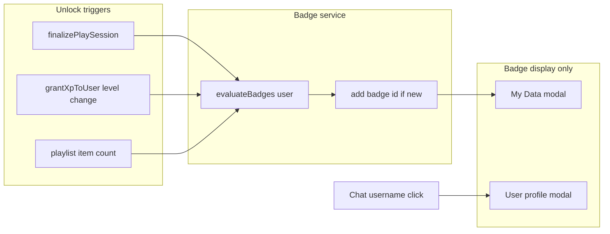

# ITVLive badge brainstorm

## Context in your codebase

- **Product:** [INTO THE VOID](public/index.html) — shared Main Stage, DJ queue, voting, XP levels 1–60, vinyl pit for listeners.
- **Theme tokens:** `[public/css/variables.css](public/css/variables.css)` — void blacks (`#050508`–`#14121c`), purple glow (`#9b5de5`, `#7b2cbf`), accent flame (`#ff6b35`), success teal (`#2ec4b6`).
- **Data today:** `user.badges: string[]` on `[server/models/User.js](server/models/User.js)`; shown as plain text in My Data (`[public/js/my-data.js](public/js/my-data.js)`). **No unlock service yet** — good fit for a single `server/config/badges.js` + checks after XP/session finalization.
- **Stats you can drive achievements from** (already incremented in `[server/services/session.js](server/services/session.js)`):
  - `totalListens`, `totalPlays` (DJ), `totalVotesGiven`, `totalVotesReceived`, `avgScoreReceived`
  - `level` / `xp` from `[server/config/levels.js](server/config/levels.js)`
Your choices: **auto achievements only** (staff grants separate) and **AI batch PNGs** for art.

### Badge display policy (your requirement)

Badges appear **only** in:

| Surface | Audience | Content |
|---------|----------|---------|
| **My Data** modal | Logged-in user (self) | Badge icon grid for own `user.badges` |
| **User profile** modal | Anyone who **clicks a chat username** | Public profile + badge grid for that account |

**Not shown:** vinyl pit tooltips, nav, online list, or icons inline in chat (names stay rank-coloured via `ITVRank.formatChatName` only).




---

## Design principles


| Principle          | Recommendation                                                                                                                            |
| ------------------ | ----------------------------------------------------------------------------------------------------------------------------------------- |
| IDs                | Stable snake_case: `first_listen`, `void_regular_10` — store in `user.badges`, never rename once live                                     |
| Difficulty curve   | ~60% of badges obtainable by level ~15–20; last ~10% for Veterans+ and long-term DJs                                                      |
| Separate from rank | Level/rank already shown via `[ITVRank](public/js/rank-colors.js)`; badges = **moments & milestones**, not duplicate “Level 30”           |
| Staff              | `resident`, `mod`, `admin` stay **role colours**, not grind badges; optional manual ids: `badge_resident`, `badge_founder` via admin only |
| Hidden badges      | Skip for v1 (auto-only); add later if you want surprise unlocks                                                                           |


**Suggested display size:** 32×32 UI, source art **128×128 PNG** (sharp on retina), transparent or void-black circular background to match vinyl discs.

---

## Tier 1 — First hour (onboarding)


| ID                | Name                      | Unlock (automatic)                                              | Icon concept                    |
| ----------------- | ------------------------- | --------------------------------------------------------------- | ------------------------------- |
| `account_created` | **Crossed the Threshold** | User document exists (grant on register)                        | Door/opening into purple void   |
| `first_listen`    | **In the Pit**            | `stats.totalListens >= 1`                                       | Small vinyl disc in void        |
| `first_vote`      | **Voice in the Void**     | `stats.totalVotesGiven >= 1` (implies level ≥ 2)                | Glowing slider / dial           |
| `first_dj_play`   | **On the Decks**          | `stats.totalPlays >= 1`                                         | Turntable needle on purple ring |
| `first_playlist`  | **Crate Started**         | Own ≥1 playlist with ≥1 item                                    | Stacked sleeves                 |
| `queue_joined`    | **Queued Up**             | First time user appears in DJ queue (one-time flag or count ≥1) | Ticket/stub with void glow      |


*Why easy:* one song cycle as listener, one vote after level 2, one DJ rotation — teaches the loop without grinding.

---

## Tier 2 — First week (habit)


| ID                   | Name                | Unlock                                | Icon concept                              |
| -------------------- | ------------------- | ------------------------------------- | ----------------------------------------- |
| `listener_10`        | **Pit Regular**     | `totalListens >= 10`                  | 10 tick marks on vinyl groove             |
| `listener_50`        | **Void Drifter**    | `totalListens >= 50`                  | Wandering comet trail around disc         |
| `voter_10`           | **Scorekeeper**     | `totalVotesGiven >= 10`               | Ten stars in arc                          |
| `voter_50`           | **Jury of One**     | `totalVotesGiven >= 50`               | Scales with purple glow                   |
| `dj_5`               | **Rotation Rookie** | `totalPlays >= 5`                     | Five-spoke DJ star                        |
| `dj_25`              | **Booth Hand**      | `totalPlays >= 25`                    | Headphones + flame accent                 |
| `level_5`            | **Novice Complete** | `level >= 5`                          | Grey novice gem (matches `--rank-novice`) |
| `level_10`           | **Regular**         | `level >= 10`                         | Green ring (Regular tier colour)          |
| `playlist_25_tracks` | **Deep Crate**      | Max tracks in any owned playlist ≥ 25 | Tall stack of records                     |
| `two_playlists`      | **Dual Crates**     | `Playlist.count >= 2` for user        | Two vinyl labels                          |


---

## Tier 3 — First month (committed)


| ID               | Name                   | Unlock                                                                 | Icon concept                                                           |
| ---------------- | ---------------------- | ---------------------------------------------------------------------- | ---------------------------------------------------------------------- |
| `listener_200`   | **Pit Dweller**        | `totalListens >= 200`                                                  | Vinyl pit silhouette full of discs                                     |
| `listener_500`   | **Void Resident**      | `totalListens >= 500`                                                  | House/dome in purple nebula (not staff role)                           |
| `voter_200`      | **Crowd Voice**        | `totalVotesGiven >= 200`                                               | Chorus waveforms                                                       |
| `dj_50`          | **Turntable Veteran**  | `totalPlays >= 50`                                                     | Worn gold label on black disc                                          |
| `dj_100`         | **Main Stage Regular** | `totalPlays >= 100`                                                    | “MAIN STAGE” micro banner on disc                                      |
| `level_20`       | **Member**             | `level >= 20`                                                          | Blue member gem                                                        |
| `level_30`       | **Veteran**            | `level >= 30`                                                          | Purple veteran gem                                                     |
| `avg_score_70`   | **Warm Reception**     | `avgScoreReceived >= 70` and `totalVotesReceived >= 20`                | Soft flame                                                             |
| `avg_score_85`   | **Crowd Favourite**    | `avgScoreReceived >= 85` and `totalVotesReceived >= 50`                | Bright flame crown                                                     |
| `high_score_set` | **Peak Moment**        | At least one play session with aggregate avg ≥ 95 and `voteCount >= 3` | Single spike/flare (requires session aggregate check once per DJ play) |


---

## Tier 4 — Seasoned (months)


| ID                   | Name                 | Unlock                                                   | Icon concept                    |
| -------------------- | -------------------- | -------------------------------------------------------- | ------------------------------- |
| `listener_1000`      | **Void Echo**        | `totalListens >= 1000`                                   | Concentric ripples              |
| `listener_2500`      | **Eternal Listener** | `totalListens >= 2500`                                   | Infinity loop on vinyl          |
| `voter_500`          | **Score Sage**       | `totalVotesGiven >= 500`                                 | Ancient dial / constellation    |
| `dj_250`             | **Deck Master**      | `totalPlays >= 250`                                      | Crossfader icon, gold trim      |
| `dj_500`             | **Rotation Legend**  | `totalPlays >= 500`                                      | Legend-colour halo (`#ffd700`)  |
| `level_40`           | **Elite**            | `level >= 40`                                            | Orange elite gem                |
| `level_50`           | **Champion**         | `level >= 50`                                            | Red champion gem                |
| `avg_score_90`       | **Stage Magnet**     | `avgScoreReceived >= 90` and `totalVotesReceived >= 100` | Magnet pulling notes            |
| `votes_received_500` | **Heard**            | `totalVotesReceived >= 500`                              | Many hands / dots toward center |


---

## Tier 5 — Endgame (prestige)


| ID                    | Name               | Unlock                                                          | Icon concept                   |
| --------------------- | ------------------ | --------------------------------------------------------------- | ------------------------------ |
| `level_60`            | **Legend**         | `level >= 60` (163,809 XP)                                      | Full gold void sun             |
| `listener_5000`       | **Voidbound**      | `totalListens >= 5000`                                          | Figure silhouetted in pit      |
| `dj_1000`             | **Archivist DJ**   | `totalPlays >= 1000`                                            | Shrine of stacked records      |
| `voter_1000`          | **Final Judge**    | `totalVotesGiven >= 1000`                                       | Gavel made of light            |
| `perfect_room`        | **Unanimous**      | One play session: `voteCount >= 5` and every vote score === 100 | Perfect circle, white-hot core |
| `playlist_100_tracks` | **Infinite Crate** | Any playlist ≥ 100 items                                        | Overflowing crate into void    |
| `year_member`         | **Anniversary**    | `createdAt` ≥ 365 days ago                                      | Calendar ring on vinyl         |


*Rough effort:* level 60 alone is ~~54k XP from listens-only at +1 XP/track (~~years of passive listening) — badge is aspirational; most endgame badges assume **active** DJ + voting mix.

---

## Combo badges (optional, still automatic)

Small set that rewards **breadth**, harder than single-stat grinds:


| ID               | Name              | Unlock                                                                                               |
| ---------------- | ----------------- | ---------------------------------------------------------------------------------------------------- |
| `triple_threat`  | **Triple Threat** | Same week: ≥5 listens, ≥5 votes, ≥1 DJ play (needs `lastActiveWeek` counters or rolling 7-day stats) |
| `pit_and_deck`   | **Pit & Deck**    | `totalListens >= 100` AND `totalPlays >= 25`                                                         |
| `voice_and_spin` | **Voice & Spin**  | `totalVotesGiven >= 100` AND `totalPlays >= 25`                                                      |


*Implementation note:* combo badges need either lightweight rolling counters on `User` or periodic cron — defer until core single-stat badges ship.

---

## AI image batch workflow (your chosen approach)

### 1. Lock a style sheet (paste into every prompt)

Use one **master style block** so 40+ badges feel like one set:

> Flat icon emblem for a dark music community app “INTO THE VOID”. Circular badge, 128×128, centered symbol, **no text**, no photoreal faces. Background: near-black `#0e0c14` with thin purple rim glow `#9b5de5`. Accent highlights `#ff6b35` sparingly. Simple shapes, high contrast, subtle vinyl groove texture optional. Game achievement icon style, clean edges, transparent PNG outside the circle.

### 2. Per-badge prompt template

```
[MASTER STYLE BLOCK]
Subject: {icon concept from table}
Mood: {tier mood: welcoming / accomplished / legendary}
Extra: minimal detail, readable at 32px
```

Generate **3 variants** per badge; pick one; run through a quick pass in remove.bg or Photopea if backgrounds are inconsistent.

### 3. File naming and storage

```
public/img/badges/{id}.png
```

Map in config:

```js
// server/config/badges.js (future)
{ id: 'first_listen', name: 'In the Pit', tier: 1, image: '/img/badges/first_listen.png', check: (u) => u.stats.totalListens >= 1 }
```

Shared client helper `public/js/badges.js`: `renderBadgeGrid(badgeIds, { showLocked })` used by **My Data** and **user profile** only.

### 4. Tier visual language (helps AI consistency)


| Tier | Rim treatment                   | Accent              |
| ---- | ------------------------------- | ------------------- |
| 1–2  | Thin purple ring                | No gold             |
| 3    | Thicker ring + soft glow        | Teal or flame dot   |
| 4    | Dual ring purple + orange       | `--rank-elite` hint |
| 5    | Gold outer ring `--rank-legend` | Flame + gold        |


Regenerate only the **rim** in prompts when upgrading feel within a tier — keeps batch coherent.

### 5. QA checklist at 32px

- Silhouette readable on `--void-panel`
- No tiny text (always fails at small size)
- Distinct from neighbouring badges in same tier
- Colour-blind: do not rely on red/green alone — use shape differences

### 6. Fallback if AI drifts

Keep one **SVG template** (circle + rim) and composite AI center icon in Figma — hybrid rescue without abandoning AI art.

---

## User profile modal (chat click)

**New UI** — chat does not open a profile today; messages lack `userId` ([`room.addChat`](server/services/room.js) only stores `displayName`, `level`, `staffRole`, `avatarUrl`).

### Server

- Add `userId` to chat message objects when sender is authenticated.
- `GET /api/users/:userId/profile` — public, rate-limited: `username`, `avatarUrl`, `customSaying`, `level`, rank, `staffRole`, `badges[]`, summary stats. No email/password.
- Guest chat clicks: no API — modal shows snapshot from message (“Guest — no badges”).

### Client

- Modal `data-modal-id="user-profile"` in [`public/index.html`](public/index.html) + [`public/js/user-profile.js`](public/js/user-profile.js).
- [`renderChat`](public/js/room.js): chat name as `<button type="button" class="chat-name …">` with `data-user-id` when present; delegated click opens modal and fetches profile.
- Reuse [`public/js/badges.js`](public/js/badges.js) `renderBadgeGrid(badgeIds)` in profile modal and My Data.

### My Data

- New **Badges** section with icon grid; remove badge comma-list from “Staff & badges” (staff role only there).

---

## Implementation order

1. `[server/config/badges.js](server/config/badges.js)` + `evaluateAndGrantBadges` after session end / level-up
2. AI assets → `public/img/badges/{id}.png`
3. Public profile API + `userId` on chat payloads
4. User profile modal + chat click wiring
5. My Data badges section (shared renderer)

**Out of scope:** vinyl tooltips, nav/online badges, chat inline icons, global unlock toasts.

**Manual only:** admin `$addToSet` / `$pull` for resident cosmetic badge ids.

---

## Suggested launch set (20 badges)

Ship tiers **1–3** first (~18 automatic + 2 combo deferred). Add tier 4–5 as the room grows so the pit does not look empty of prestige icons on day one.

**Launch 20:** all Tier 1, all Tier 2, and from Tier 3: `listener_200`, `dj_50`, `level_20`, `level_30`, `avg_score_70`, `avg_score_85`.

---

## Rank vs badge (avoid clutter)


| Already shown     | Do not duplicate as badge                                                                                 |
| ----------------- | --------------------------------------------------------------------------------------------------------- |
| Level / rank name | “Level 30 badge” — use **Member/Veteran gem** badges only at tier breakpoints (5, 10, 20, 30, 40, 50, 60) |
| Staff role        | Separate manual `badge_`* if desired, not grind                                                           |


Chat keeps rank colours on names only; badges are viewed deliberately via click (others) or My Data (self).